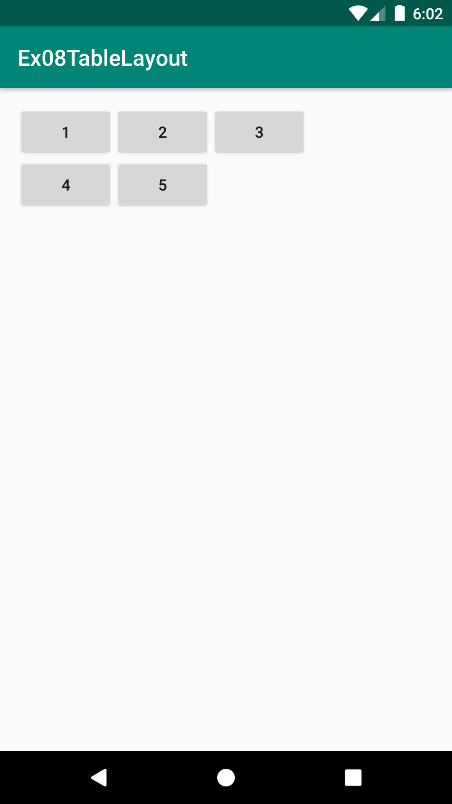
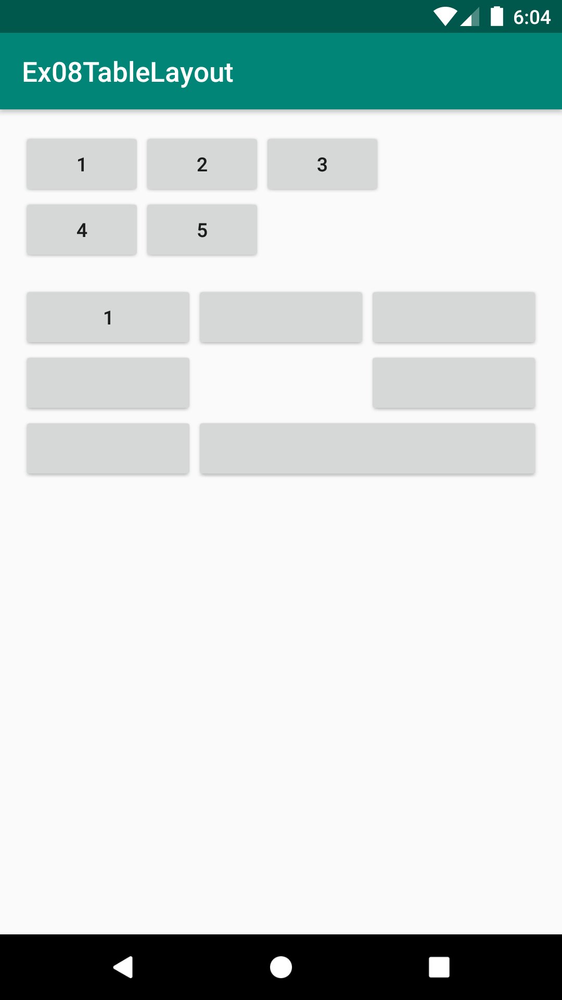
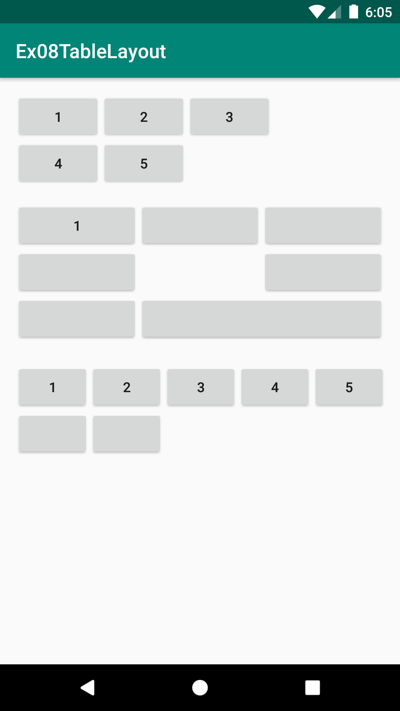
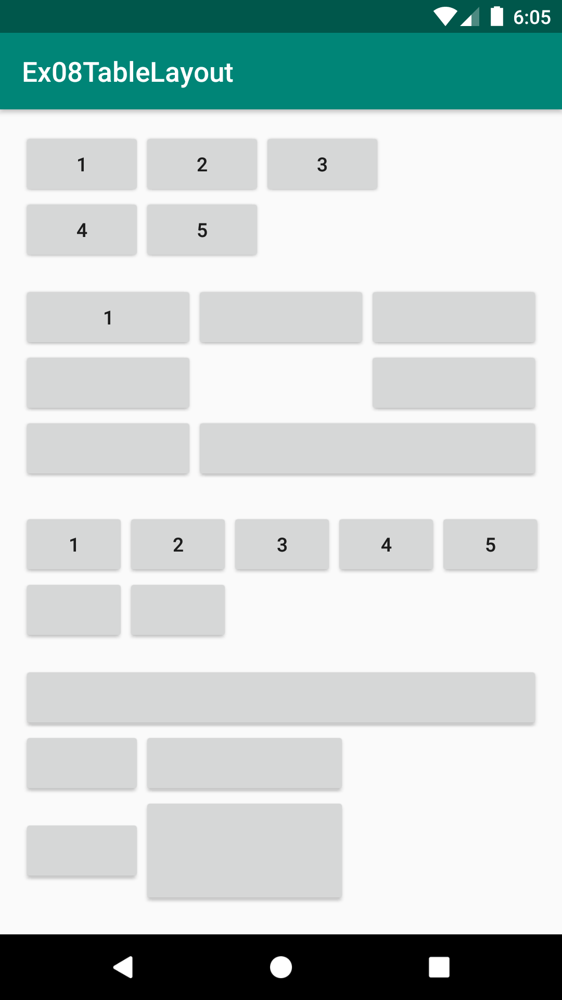

# Ex08TableLayout
안드로이드 네이티브 앱 개발 수업 예제#8

# 주요코드
TableLayout 알아보기
 > TableLayout은 LineaerLayout을 상속하였기에 뷰들이 겹쳐질 수 없음 : 기본적으로 LinearLayout의 중첩구조를 위해 만들어진 Layout

- res폴더>>layout폴더안에 있는 activity_main.xml문서를 수정하여 화면제작
- TableLayout뷰는 LinearLayout의 vertical orientaion을 기반으로 만들어진 뷰
- TableRow뷰는  LinearLayout의 horizontal orientaion을 기반으로 만들어진 뷰
- TableLayout안에 TableRow로 한줄씩 배치하는 방식의 Layout
- 자식뷰들의 사이즈 지정(layout_widht, layout_height)이 명시적으로 없이도 기본 wrap_content로 지정되어 코딩이 간소화되는 이점이 있음
- TableLayout의 layout_column, layout_span, stretchColumns, shrinkColumns, collapseColumns속성들 적용하기

# 실행모습

  
  
  
  

